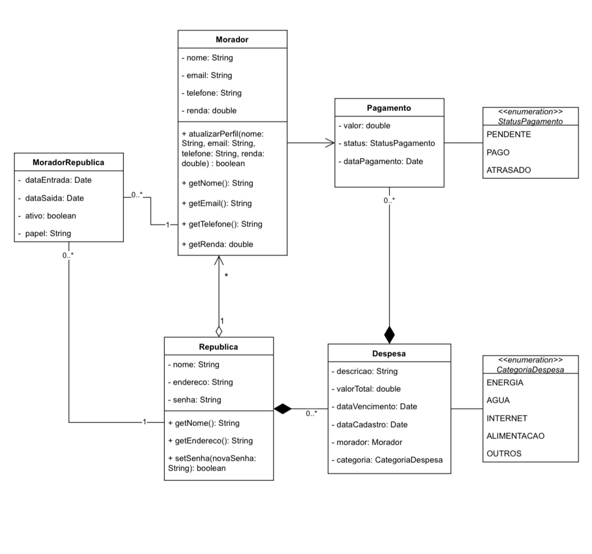

# Documentação - República Fácil

Bem-vindo à documentação central do projeto **República Fácil**. Este repositório contém todos os artefatos de planejamento, arquitetura e design do projeto.

O código-fonte da aplicação pode ser encontrado nos seguintes repositórios:
- **Backend:** [republica-facil/republica_facil_backend](https://github.com/Republica-Facil/republica_facil_backend)
- **Frontend:** (link para o frontend)

---

## 📂 Estrutura da Documentação

### 1. 📋 Backlog e Histórias de Usuário

O backlog completo do produto, com as épicos e histórias de usuário que guiam o desenvolvimento.

➡️ **[Acessar o Backlog](./backlog/BACKLOG.md)**

---

### 2. 📐 Diagramas de Arquitetura (UML)

Diagramas que ilustram a arquitetura do sistema, o modelo de dados e os fluxos de interação.

- **Diagrama de Casos de Uso:**
  

- **Diagrama de Classes:**
  *(Adicione outros diagramas conforme necessário)*

➡️ **[Ver todos os diagramas na pasta](./diagramas/)**

---

### 3. 🎨 Protótipo de Interface (UI/UX)

O protótipo navegável da aplicação, mostrando o design das telas e a experiência do usuário.

➡️ **[Visualizar o Protótipo em PDF](./prototipos/seu-prototipo.pdf)**

---